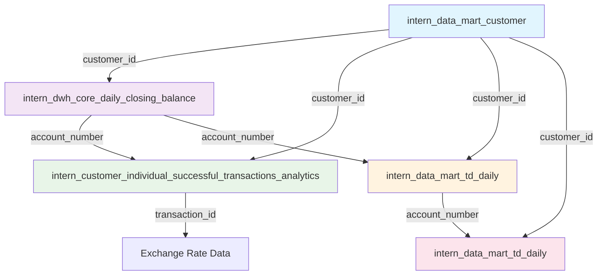

# 🏦 Bank Jago Data Architecture - Technical Documentation

**Author**: Risk Data Analyst Intern  
**Date**: September 10, 2025  
**Purpose**: Technical understanding of Bank Jago's core data systems and flow

---

## 📋 Table of Contents
1. [Overview](#overview)
2. [Core Banking Systems](#core-banking-systems)
3. [Data Tables Architecture](#data-tables-architecture)
4. [Data Flow & Relationships](#data-flow--relationships)
5. [Key Technical Concepts](#key-technical-concepts)
6. [Data Quality & Integration](#data-quality--integration)
7. [Use Cases & Applications](#use-cases--applications)

---

## 🎯 Overview

Bank Jago operates a **multi-core banking architecture** with 4 distinct systems handling different customer segments and products. This documentation maps the technical flow of data across these systems based on analysis of the `intern_*` tables.

### **Architecture Highlights**
- **4 Core Banking Systems**: LFS, WINCORE, OLIBS724, LP
- **5 Primary Data Tables**: Customer, Balance, Transactions, Term Deposits, CASA TD
- **Multi-currency Support**: IDR, USD (with real-time FX rates)
- **Real-time Integration**: Daily snapshots with transaction-level tracking

---

## 🏗️ Core Banking Systems

### **1. LFS (Latest Financial System) - Modern Platform**
```yaml
System Type: Primary modern core banking
Market Share: 27.53% (237,295 customers in Aug 2025)
Key Features:
  - Sharia-compliant products (Zero Saving, Zero Expense)
  - Multi-currency support (IDR, USD via FX Pockets)
  - GoPay ecosystem integration
  - Real-time transaction processing
  - Pocket-based account structure

Customer Profile:
  - Individual consumers
  - Tech-savvy users
  - Sharia banking preference
  - Multi-pocket usage pattern

Partner Ecosystem: 10 channels
  - GoPay Unified KYC
  - Bibit, Stockbit integration  
  - Jago Sharia standalone
  - Kredit Pintar partnerships
```

### **2. WINCORE - Legacy High-Value Platform**
```yaml
System Type: Legacy corporate/high-value
Market Share: 42.22% (363,883 customers)
Key Features:
  - Term deposit specialization
  - High-value customer focus
  - Conventional banking products
  - Mature product suite

Customer Profile:
  - High-net-worth individuals
  - Corporate clients
  - Term deposit investors
  - Average balance: Rp 3.69 billion per customer

Partner Ecosystem: 1 channel (focused distribution)
```

### **3. OLIBS724 - Sharia Banking Platform**
```yaml
System Type: Islamic banking core
Market Share: 0.08% (650 customers)
Key Features:
  - Full Sharia compliance
  - Mudharabah term deposits
  - Profit-sharing mechanisms
  - PSIA (Profit Sharing Investment Account) support

Customer Profile:
  - Sharia-focused customers
  - Mudharabah deposit holders
  - Long-term relationship banking

Partner Ecosystem: 1 channel (specialized)
```

### **4. LP (Lending Platform)**
```yaml
System Type: Lending-focused system
Market Share: 30.18% (260,099 customers)
Key Features:
  - Credit/lending operations
  - Partnership lending programs
  - Direct customer acquisition
  - No traditional savings products

Customer Profile:
  - Borrowers and credit customers
  - Partnership lending recipients

Partner Ecosystem: 0 channels (direct acquisition)
```

---

## 📊 Data Tables Architecture

### **1. `intern_data_mart_customer` - Master Customer Table**

**Purpose**: Central customer registry across all core banking systems

```sql
-- Key Fields Structure
TABLE: intern_data_mart_customer {
  PRIMARY KEY: customer_id, business_date
  
  -- Customer Identity
  customer_id: STRING              -- Unique across all systems
  id_number: STRING                -- KTP/National ID (for deduplication)
  customer_cif: STRING             -- Mambu-generated CIF
  
  -- System Integration
  customer_source: STRING          -- LFS|WINCORE|OLIBS724|LP
  business_date: DATE              -- Snapshot date
  customer_start_date: DATE        -- Onboarding date
  
  -- Customer Profile
  customer_status: STRING          -- ACTIVE|INACTIVE|CLOSED
  customer_type_code: STRING       -- Individual/Corporate classification
  age: INTEGER                     -- Customer age
  main_account_number: STRING      -- Primary account reference
  
  -- Business Context
  partner_name: STRING             -- Acquisition channel
  business_unit: STRING            -- Funding|Lending
  
  -- Financial Summary
  total_balance: NUMERIC           -- Total customer balance
  balance_tier_description: STRING -- Risk/value tier
  customer_risk_status: STRING     -- LOW|MEDIUM|HIGH
  
  -- Product Flags
  has_gopay_saving_account: BOOLEAN
  has_mudharabah_account: BOOLEAN
  jago_app_installation_status: STRING
}
```

**Data Quality Metrics:**
- **Coverage**: 861,927 customer records (August 2025)
- **Uniqueness**: 770,542 unique individuals (1.12 avg products/person)
- **Cross-Platform Users**: 11.76% have multiple core banking relationships

### **2. `intern_dwh_core_daily_closing_balance` - Account Balance Ledger**

**Purpose**: Daily position for all customer accounts across core banking systems

```sql
-- Key Fields Structure  
TABLE: intern_dwh_core_daily_closing_balance {
  PRIMARY KEY: account_number, full_date
  
  -- Account Identity
  account_number: STRING           -- Unique account identifier
  customer_id: STRING              -- Links to customer table
  customer_source: STRING          -- LFS|WINCORE|OLIBS724
  cif: STRING                      -- Customer Information File
  
  -- Account Classification
  account_type: STRING             -- Main Account, FX Pocket USD, etc.
  account_category: STRING         -- SAVINGS|CURRENT|TERM DEPOSIT
  account_status: STRING           -- ACTIVE|INACTIVE|CLOSED
  account_code: STRING             -- Internal product code
  
  -- Balance Information
  full_date: DATE                  -- Position date
  total_balance: NUMERIC           -- IDR equivalent balance
  currency_code: STRING            -- IDR|USD|others
  closing_balance_timestamp: TIMESTAMP -- Exact balance calculation time
  
  -- Transaction Context
  last_transaction_id: STRING      -- Most recent transaction
  interest_accrued: NUMERIC        -- Accrued interest amount
  
  -- Organizational
  branch_id: STRING                -- Branch/division code
  transaction_source: STRING       -- Source system identifier
}
```

**Currency Support:**
- **Primary**: IDR (Indonesian Rupiah)
- **Foreign**: USD (US Dollar) with real-time FX conversion
- **FX Integration**: Exchange rates from transaction table (latest: 16,486 IDR/USD)

### **3. `intern_customer_individual_successful_transactions_analytics` - Transaction Log**

**Purpose**: Complete transaction history with detailed analytics and FX rates

```sql
-- Key Fields Structure
TABLE: intern_customer_individual_successful_transactions_analytics {
  PRIMARY KEY: transaction_id
  
  -- Transaction Identity
  transaction_id: STRING           -- Unique transaction ID
  customer_id: STRING              -- Transaction owner
  transaction_unenriched_id: STRING -- Original system transaction ID
  
  -- Transaction Details
  transaction_date: DATE           -- Transaction date
  transaction_datetime: TIMESTAMP  -- Precise transaction time
  transaction_status: STRING       -- SUCCEED|FAILED|PENDING
  transaction_source: STRING       -- LFS|WINCORE|OLIBS724
  
  -- Amount & Currency
  transaction_amount: NUMERIC      -- IDR amount
  transaction_amount_currency: STRING -- Usually IDR
  non_idr_transaction_amount: NUMERIC -- Foreign currency amount
  non_idr_transaction_amount_currency: STRING -- USD|others
  exchange_rate: NUMERIC           -- FX rate applied
  
  -- Account Information
  source_account_number: STRING    -- Debit account
  source_account_type: STRING      -- Account type classification
  beneficiary_account_number: STRING -- Credit account
  beneficiary_customer_id: STRING -- Recipient customer
  
  -- Transaction Classification
  transaction_code: STRING         -- Internal transaction code
  transaction_category: STRING     -- POS|TRANSFER|QRIS|etc.
  category_code: STRING            -- Detailed category
  transaction_code_description: STRING -- Human readable description
  
  -- Balance Impact
  total_balance: NUMERIC           -- Balance after transaction
  debit_credit_flag: STRING        -- DEBIT|CREDIT
  
  -- Payment Context
  payment_instruction_id: STRING   -- Payment system reference
  payment_service_type: STRING     -- QRIS|BIFAST|JAGOPAY|etc.
  merchant: STRING                 -- Merchant name
  merchant_id: STRING              -- Merchant identifier
  
  -- Additional Context
  note: STRING                     -- Transaction description/note
  mcc_code: STRING                 -- Merchant category code
  is_bifast_transaction: BOOLEAN   -- Inter-bank transfer flag
}
```

**Transaction Categories:**
- **QRIS**: QR-based payments (GoPay, merchants)
- **BIFAST**: Inter-bank transfers (real-time)
- **JAGOPAY**: Internal Jago ecosystem payments
- **TRANSFER**: Account-to-account transfers (internal/external)

### **4. `intern_data_mart_td_daily` - Term Deposit Portfolio**

**Purpose**: Daily positions for term deposit products across all systems

```sql
-- Key Fields Structure
TABLE: intern_data_mart_td_daily {
  PRIMARY KEY: account_number, business_date
  
  -- Account Identity
  customer_id: STRING              -- Links to customer table
  account_number: STRING           -- TD account number
  source_system: STRING            -- LFS|WINCORE|OLIBS724
  
  -- Product Details
  product_type: STRING             -- Always 'TD'
  product_subtype: STRING          -- Specific TD product name
  business_stream: STRING          -- CONVENTIONAL|SHARIA
  
  -- Financial Terms
  balance: NUMERIC                 -- Current TD balance
  interest_rate: NUMERIC           -- Annual interest rate (%)
  profit_sharing_rate: NUMERIC     -- For Sharia products
  tenor: INTEGER                   -- Term in months
  
  -- Dates & Maturity
  business_date: DATE              -- Snapshot date
  start_date: DATE                 -- TD start date
  maturity_date: DATE              -- TD maturity date
  closed_date: DATE                -- If closed early
  remaining_maturity_days: INTEGER -- Days to maturity
  
  -- TD Management
  automatic_rollover: STRING       -- ARO (Auto Rollover)
  is_early_redemption: BOOLEAN     -- Early withdrawal flag
  is_psia: BOOLEAN                 -- Sharia investment account flag
  
  -- Risk & Compliance
  golongan_pihak_lawan: STRING     -- Related party classification
  customer_type_lcr: STRING        -- Regulatory classification
  
  -- Performance Metrics
  accrued_interest: NUMERIC        -- Interest earned
  average_balance_30_days: NUMERIC -- 30-day average balance
  number_of_transactions: INTEGER  -- Transaction count
}
```

**Term Deposit Products:**
- **Conventional**: Digital TD (1M, 3M, 6M, 12M terms)
- **Sharia**: Mudharabah deposits (profit-sharing basis)
- **GoPay Integration**: GoPay Term Deposit products
- **Auto Rollover**: Automatic renewal at maturity

### **5. `intern_data_mart_td_daily` - CASA & Term Deposit Combined View**

**Purpose**: Unified view of Current Account, Savings Account, and Term Deposit data

```sql
-- Key Fields Structure (Based on data dictionary)
TABLE: intern_data_mart_td_daily {
  PRIMARY KEY: account_number, business_date
  
  -- Account Basics
  customer_id: STRING
  account_number: STRING
  source_system: STRING
  business_date: DATE
  account_status: STRING
  
  -- Product Classification
  product_type: STRING             -- SA (Savings) | CA (Current) | TD (Term Deposit)
  product_subtype: STRING          -- Specific product details
  business_stream: STRING          -- CONVENTIONAL|SHARIA
  
  -- Financial Details
  balance: NUMERIC                 -- Account balance
  interest_rate: NUMERIC           -- Interest/profit rate
  profit_sharing_rate: NUMERIC     -- For Sharia products
  currency: STRING                 -- Account currency
  foreign_balance: NUMERIC         -- Foreign currency amount
  
  -- Term Deposit Specific
  tenor: INTEGER                   -- For TD products
  maturity_date: DATE              -- For TD products
  start_date: DATE                 -- For TD products
  
  -- Transaction Activity
  amount_in: NUMERIC               -- Inflow amount
  amount_out: NUMERIC              -- Outflow amount
  number_of_transactions: INTEGER  -- Transaction count
  mtd_number_of_transactions: INTEGER -- Month-to-date transactions
  
  -- Balance Analytics
  average_balance_30_days: NUMERIC
  mtd_average_daily_balance: NUMERIC
  average_daily_transactions: NUMERIC
  
  -- Pocket Management (LFS specific)
  is_locked_pocket: STRING         -- Locked/Non-Locked Pocket
  locked_pocket_start_date: DATE
  locked_pocket_end_date: DATE
  locked_pocket_period: INTEGER
}
```

---

## 🔄 Data Flow & Relationships

### **Primary Key Relationships**



### **Data Integration Points**

#### **1. Customer 360 View**
```sql
-- Complete customer profile combining all tables
SELECT 
    c.customer_id,
    c.customer_source,
    c.customer_start_date,
    c.customer_status,
    
    -- Balance Summary
    COUNT(DISTINCT b.account_number) as total_accounts,
    SUM(b.total_balance) as total_balance_idr,
    COUNT(DISTINCT CASE WHEN b.currency_code = 'USD' THEN b.account_number END) as usd_accounts,
    
    -- Transaction Activity
    COUNT(t.transaction_id) as transaction_count,
    SUM(CASE WHEN t.debit_credit_flag = 'DEBIT' THEN t.transaction_amount ELSE 0 END) as total_debits,
    SUM(CASE WHEN t.debit_credit_flag = 'CREDIT' THEN t.transaction_amount ELSE 0 END) as total_credits,
    
    -- Term Deposit Portfolio
    COUNT(td.account_number) as td_count,
    SUM(td.balance) as td_balance,
    AVG(td.interest_rate) as avg_td_rate

FROM intern_data_mart_customer c
LEFT JOIN intern_dwh_core_daily_closing_balance b ON c.customer_id = b.customer_id
LEFT JOIN intern_customer_individual_successful_transactions_analytics t ON c.customer_id = t.customer_id
LEFT JOIN intern_data_mart_td_daily td ON c.customer_id = td.customer_id
WHERE c.business_date = '2025-08-31'
  AND b.full_date = '2025-08-31'
  AND td.business_date = '2025-08-31'
GROUP BY c.customer_id, c.customer_source, c.customer_start_date, c.customer_status;
```

#### **2. Cross-System Customer Journey**
```sql
-- Track customer across multiple core banking systems
WITH customer_platforms AS (
    SELECT 
        id_number,
        STRING_AGG(DISTINCT customer_source, ', ') as platforms_used,
        COUNT(DISTINCT customer_source) as platform_count,
        MIN(customer_start_date) as first_onboarding,
        MAX(customer_start_date) as latest_onboarding
    FROM intern_data_mart_customer
    WHERE business_date = '2025-08-31'
    GROUP BY id_number
)
SELECT 
    platform_count,
    COUNT(*) as customer_count,
    ROUND(COUNT(*) * 100.0 / SUM(COUNT(*)) OVER(), 2) as percentage
FROM customer_platforms
GROUP BY platform_count
ORDER BY platform_count;
```

#### **3. Multi-Currency Balance Conversion**
```sql
-- Convert all balances to IDR using latest FX rates
WITH latest_fx_rates AS (
    SELECT 
        non_idr_transaction_amount_currency,
        exchange_rate,
        ROW_NUMBER() OVER (
            PARTITION BY non_idr_transaction_amount_currency 
            ORDER BY transaction_datetime DESC
        ) as rn
    FROM intern_customer_individual_successful_transactions_analytics
    WHERE exchange_rate > 1000  -- Filter realistic rates
      AND transaction_date >= '2025-08-01'
)
SELECT 
    b.customer_id,
    b.currency_code,
    b.total_balance as original_balance,
    CASE 
        WHEN b.currency_code = 'IDR' THEN b.total_balance
        ELSE b.total_balance * fx.exchange_rate
    END as balance_idr_equivalent
FROM intern_dwh_core_daily_closing_balance b
LEFT JOIN latest_fx_rates fx ON b.currency_code = fx.non_idr_transaction_amount_currency AND fx.rn = 1
WHERE b.full_date = '2025-08-31';
```

---

## 🔧 Key Technical Concepts

### **1. Core Banking System Architecture**

**Multi-Core Strategy:**
- **Horizontal Scaling**: Different systems handle different customer segments
- **Legacy Integration**: WINCORE/OLIBS724 maintain existing high-value customers
- **Modern Platform**: LFS handles new digital customers with advanced features
- **Specialized Systems**: LP focuses on lending, OLIBS724 on Sharia compliance

### **2. Customer Identity Management**

**Primary Identifiers:**
```yaml
customer_id:
  - Unique across all systems
  - Format varies by system (LFS: alphanumeric, WINCORE: numeric)
  - Primary key for all customer operations

id_number:
  - Indonesian KTP (national ID)
  - Used for cross-system deduplication
  - Enables tracking across multiple platforms

customer_cif:
  - Mambu-generated Customer Information File
  - Used for transaction processing
  - Secondary identifier for system operations
```

### **3. Account Structure Concepts**

**LFS Pocket System:**
```yaml
Main Account (SMA):
  - Primary customer account
  - Central balance management
  - Transaction hub

Expense Pockets (SDC):
  - Savings categories (Zero Expense Pot)
  - Budget allocation accounts
  - Transfer between pockets

FX Pockets:
  - Multi-currency support (USD)
  - Real-time FX conversion
  - Foreign exchange transactions

Locked Pockets:
  - Time-based restrictions
  - Goal-based savings
  - Automated savings features
```

**Traditional Banking (WINCORE/OLIBS724):**
```yaml
Account Types:
  - Current Account (GIRO)
  - Savings Account (TABUNGAN)
  - Term Deposit (DEPOSITO)
  - Corporate Accounts (higher balances)
```

### **4. Transaction Processing Architecture**

**Real-Time Systems:**
- **BIFAST**: Bank Indonesia Fast Payment System (inter-bank)
- **QRIS**: Quick Response Code Indonesian Standard
- **JAGOPAY**: Internal Jago ecosystem payments

**Batch Processing:**
- **Daily Closing Balance**: End-of-day position calculation
- **Interest Accrual**: Daily interest calculation for TD products
- **Risk Assessment**: Daily customer risk scoring updates

### **5. Data Consistency & Quality**

**Snapshot Strategy:**
```yaml
business_date / full_date:
  - Daily snapshots for historical analysis
  - Point-in-time consistency across tables
  - Enables time-series analysis

Data Linkage Quality:
  - Customer-Balance Match Rate: 27.61% (237,969/861,927)
  - Explanation: LP customers have no traditional deposit products
  - Cross-platform customers: 11.76% use multiple systems
```

---

## 📊 Data Quality & Integration

### **Current State Assessment (August 2025)**

#### **Data Coverage Analysis**
```yaml
Customer Coverage:
  Total Customers: 861,927
  With Balance Data: 237,969 (27.61%)
  Transaction History: ~100% for active accounts
  
System Distribution:
  LFS: 237,295 customers (27.53%) - Full data coverage
  WINCORE: 363,883 customers (42.22%) - Limited balance data (24 customers)
  OLIBS724: 650 customers (0.08%) - Full coverage  
  LP: 260,099 customers (30.18%) - No traditional balance products

Balance Data Quality:
  Total Accounts: 414,620
  Total Balance: Rp 176.6 billion
  Average Balance: Rp 425,831 per account
  Currency Support: IDR (primary), USD (FX pockets)
```

#### **Integration Challenges & Solutions**

**Challenge 1: WINCORE Balance Data Gap**
```yaml
Problem: Only 24 WINCORE customers have balance data despite 363,883 total
Root Cause: Different balance reporting system/timing
Impact: Incomplete customer 360 view
Solution: 
  - Implement daily WINCORE balance extract
  - Historical backfill for trend analysis
  - Real-time balance API integration
```

**Challenge 2: LP System Integration**
```yaml
Problem: LP customers (260,099) show no balance accounts
Root Cause: LP is lending-focused, no traditional deposit products  
Impact: Expected behavior, not a data quality issue
Solution:
  - Add loan portfolio data from LP system
  - Create lending-specific analytics tables
  - Integrate credit exposure metrics
```

**Challenge 3: Cross-Platform Customer Tracking**
```yaml
Current State: 11.76% customers use multiple platforms
Data Quality: Good (770,542 unique individuals identified)
Opportunity: Cross-selling analytics and unified customer experience
Solution:
  - Master customer registry with id_number as key
  - Cross-platform journey analytics
  - Unified customer risk assessment
```

### **Recommended Data Architecture Improvements**

#### **1. Real-Time Data Pipeline**
```sql
-- Implement real-time balance updates
CREATE OR REPLACE TABLE real_time_customer_balance AS
SELECT 
    customer_id,
    SUM(total_balance) as current_balance,
    CURRENT_TIMESTAMP() as last_updated
FROM intern_dwh_core_daily_closing_balance
WHERE full_date = CURRENT_DATE()
GROUP BY customer_id;

-- Trigger on transaction table to update real-time balances
```

#### **2. Master Data Management**
```sql
-- Create unified customer master
CREATE OR REPLACE TABLE customer_master_registry AS
SELECT 
    id_number as master_key,
    ARRAY_AGG(STRUCT(customer_id, customer_source, customer_start_date)) as customer_records,
    MIN(customer_start_date) as first_relationship_date,
    COUNT(DISTINCT customer_source) as platform_count,
    SUM(total_balance) as total_relationship_balance
FROM intern_data_mart_customer
WHERE business_date = CURRENT_DATE()
  AND customer_status = 'ACTIVE'
GROUP BY id_number;
```

#### **3. Currency Management System**
```sql
-- Automated FX rate updates
CREATE OR REPLACE TABLE fx_rates_daily AS
WITH latest_rates AS (
    SELECT 
        non_idr_transaction_amount_currency as currency,
        AVG(exchange_rate) as avg_rate,
        MIN(exchange_rate) as min_rate,  
        MAX(exchange_rate) as max_rate,
        COUNT(*) as transaction_count,
        DATE(transaction_datetime) as rate_date
    FROM intern_customer_individual_successful_transactions_analytics
    WHERE exchange_rate BETWEEN 1000 AND 20000  -- Realistic IDR/USD range
      AND DATE(transaction_datetime) >= CURRENT_DATE() - 30
    GROUP BY currency, DATE(transaction_datetime)
)
SELECT * FROM latest_rates WHERE currency IS NOT NULL;
```

---

## 💡 Use Cases & Applications

### **1. Customer Onboarding Analysis**

**Business Question**: "How effective are our onboarding channels?"

```sql
-- Channel performance analysis
SELECT 
    partner_name,
    customer_source,
    COUNT(*) as customers_acquired,
    AVG(total_balance) as avg_customer_value,
    SUM(total_balance) as total_value_acquired,
    COUNT(*) * 100.0 / SUM(COUNT(*)) OVER() as market_share_percent
FROM intern_data_mart_customer c
LEFT JOIN intern_dwh_core_daily_closing_balance b ON c.customer_id = b.customer_id
WHERE c.business_date = '2025-08-31'
  AND b.full_date = '2025-08-31'  
  AND DATE_TRUNC(c.customer_start_date, MONTH) = '2025-08-01'
GROUP BY partner_name, customer_source
ORDER BY customers_acquired DESC;
```

### **2. Cross-Platform Customer Journey**

**Business Question**: "How do customers use multiple banking platforms?"

```sql
-- Multi-platform customer analysis
WITH customer_journey AS (
    SELECT 
        id_number,
        customer_id,
        customer_source,
        customer_start_date,
        total_balance,
        ROW_NUMBER() OVER (PARTITION BY id_number ORDER BY customer_start_date) as platform_sequence
    FROM intern_data_mart_customer
    WHERE business_date = '2025-08-31'
      AND customer_status = 'ACTIVE'
),
journey_patterns AS (
    SELECT 
        id_number,
        STRING_AGG(customer_source, ' → ' ORDER BY platform_sequence) as customer_journey,
        COUNT(*) as platform_count,
        DATE_DIFF(MAX(customer_start_date), MIN(customer_start_date), DAY) as journey_days,
        SUM(total_balance) as total_relationship_value
    FROM customer_journey
    GROUP BY id_number
)
SELECT 
    customer_journey,
    COUNT(*) as customer_count,
    AVG(total_relationship_value) as avg_relationship_value,
    AVG(journey_days) as avg_journey_duration_days
FROM journey_patterns
WHERE platform_count > 1
GROUP BY customer_journey
ORDER BY customer_count DESC;
```

### **3. Product Performance Analysis**

**Business Question**: "Which term deposit products are most successful?"

```sql
-- Term deposit product analysis
SELECT 
    td.product_subtype,
    td.business_stream,
    td.source_system,
    COUNT(*) as total_accounts,
    SUM(td.balance) as total_balance,
    AVG(td.balance) as avg_balance,
    AVG(td.interest_rate) as avg_interest_rate,
    AVG(td.tenor) as avg_tenor_months,
    COUNT(CASE WHEN td.automatic_rollover = 'ARO' THEN 1 END) as auto_rollover_count,
    COUNT(CASE WHEN td.is_early_redemption = true THEN 1 END) as early_redemption_count,
    
    -- Performance metrics
    COUNT(CASE WHEN td.automatic_rollover = 'ARO' THEN 1 END) * 100.0 / COUNT(*) as rollover_rate_percent,
    COUNT(CASE WHEN td.is_early_redemption = true THEN 1 END) * 100.0 / COUNT(*) as early_redemption_rate_percent
    
FROM intern_data_mart_td_daily td
WHERE td.business_date = '2025-08-31'
  AND td.balance > 0
GROUP BY td.product_subtype, td.business_stream, td.source_system
ORDER BY total_balance DESC;
```

### **4. Foreign Exchange Analytics**

**Business Question**: "How significant is our USD business?"

```sql
-- Multi-currency customer analysis
WITH fx_customer_analysis AS (
    SELECT 
        b.customer_id,
        b.currency_code,
        b.total_balance as foreign_balance,
        CASE 
            WHEN b.currency_code = 'USD' THEN b.total_balance * 16486  -- Latest USD rate
            ELSE b.total_balance
        END as idr_equivalent,
        c.customer_source,
        c.customer_start_date
    FROM intern_dwh_core_daily_closing_balance b
    JOIN intern_data_mart_customer c ON b.customer_id = c.customer_id
    WHERE b.full_date = '2025-08-31'
      AND c.business_date = '2025-08-31'
      AND b.total_balance > 0
),
currency_summary AS (
    SELECT 
        currency_code,
        customer_source,
        COUNT(DISTINCT customer_id) as customers,
        SUM(foreign_balance) as total_foreign_balance,
        SUM(idr_equivalent) as total_idr_equivalent,
        AVG(idr_equivalent) as avg_balance_idr
    FROM fx_customer_analysis
    GROUP BY currency_code, customer_source
)
SELECT 
    currency_code,
    customer_source,
    customers,
    CASE 
        WHEN currency_code = 'USD' THEN CONCAT('$', FORMAT_NUMBER(total_foreign_balance, 2))
        ELSE CONCAT('Rp ', FORMAT_NUMBER(total_foreign_balance, 0))
    END as formatted_balance,
    CONCAT('Rp ', FORMAT_NUMBER(total_idr_equivalent, 0)) as idr_equivalent,
    CONCAT('Rp ', FORMAT_NUMBER(avg_balance_idr, 0)) as avg_balance,
    ROUND(customers * 100.0 / SUM(customers) OVER(), 2) as customer_share_percent,
    ROUND(total_idr_equivalent * 100.0 / SUM(total_idr_equivalent) OVER(), 2) as balance_share_percent
FROM currency_summary
ORDER BY total_idr_equivalent DESC;
```

### **5. Transaction Pattern Analysis**

**Business Question**: "What are the most common customer transaction patterns?"

```sql
-- Transaction pattern analysis
SELECT 
    t.transaction_category,
    t.payment_service_type,
    COUNT(*) as transaction_count,
    COUNT(DISTINCT t.customer_id) as unique_customers,
    SUM(t.transaction_amount) as total_volume,
    AVG(t.transaction_amount) as avg_transaction_amount,
    
    -- Customer behavior
    COUNT(*) * 1.0 / COUNT(DISTINCT t.customer_id) as avg_transactions_per_customer,
    
    -- Temporal patterns  
    COUNT(CASE WHEN EXTRACT(HOUR FROM t.transaction_datetime) BETWEEN 9 AND 17 THEN 1 END) as business_hours_count,
    COUNT(CASE WHEN EXTRACT(DAYOFWEEK FROM t.transaction_date) IN (1, 7) THEN 1 END) as weekend_count,
    
    -- Success rate
    COUNT(CASE WHEN t.transaction_status = 'SUCCEED' THEN 1 END) * 100.0 / COUNT(*) as success_rate_percent
    
FROM intern_customer_individual_successful_transactions_analytics t
WHERE t.transaction_date BETWEEN '2025-08-01' AND '2025-08-31'
  AND t.transaction_status = 'SUCCEED'
GROUP BY t.transaction_category, t.payment_service_type
HAVING transaction_count > 1000  -- Focus on significant patterns
ORDER BY total_volume DESC;
```

---

## 🎯 Key Insights & Technical Recommendations

### **Data Architecture Strengths**
1. **Multi-Core Flexibility**: Supports diverse customer segments effectively
2. **Real-Time Integration**: Transaction processing with immediate balance updates  
3. **Cross-Platform Identity**: Strong customer deduplication with id_number
4. **Multi-Currency Support**: Native USD support with real-time FX rates
5. **Comprehensive Analytics**: Rich transaction and balance history

### **Areas for Improvement**
1. **WINCORE Integration**: Implement real-time balance feeds
2. **LP System Enhancement**: Add lending portfolio analytics
3. **Data Pipeline Optimization**: Reduce latency for cross-system queries
4. **Master Data Management**: Unified customer registry across all platforms
5. **Real-Time Analytics**: Move from daily snapshots to real-time dashboards

### **Business Value Opportunities**
1. **Cross-Selling**: 679,913 single-platform customers for expansion
2. **Premium Services**: 726 multi-platform customers for VIP programs  
3. **FX Business**: Growing USD customer base with significant balances
4. **Product Innovation**: Sharia products showing strong adoption potential
5. **Partnership Expansion**: LFS 10-channel model can be replicated across systems

---

## 📚 Technical Reference

### **Table Relationships Summary**
```yaml
Master Table: intern_data_mart_customer
  - Links to ALL other tables via customer_id
  - Contains customer lifecycle and profile data
  - Business date snapshots for historical analysis

Balance Table: intern_dwh_core_daily_closing_balance  
  - Account-level daily positions
  - Multi-currency support (IDR, USD)
  - Links to customer via customer_id

Transaction Table: intern_customer_individual_successful_transactions_analytics
  - Complete transaction history
  - Real-time FX rates embedded
  - Links to customer and accounts

Term Deposit Table: intern_data_mart_td_daily
  - Specialized TD product analytics
  - Maturity and rollover tracking  
  - Links to customer via customer_id

CASA-TD Table: intern_data_mart_td_daily
  - Unified view of all account types
  - Pocket management for LFS customers
  - Comprehensive balance and activity metrics
```

### **Query Performance Tips**
1. **Always filter by business_date/full_date** for partition pruning
2. **Use customer_id for primary joins** across tables
3. **Leverage customer_source** for system-specific analysis  
4. **Include currency_code** in USD/FX queries for accurate filtering
5. **Use transaction_status = 'SUCCEED'** for successful transaction analysis

---

**Documentation Version**: 1.0  
**Last Updated**: September 10, 2025  
**Next Review**: Monthly (with new data releases)